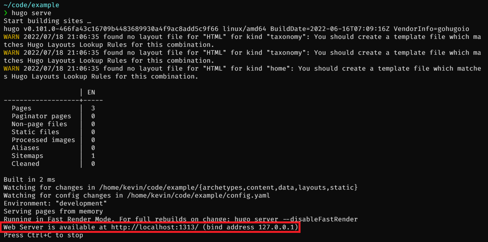
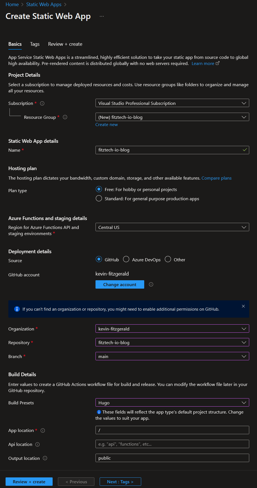
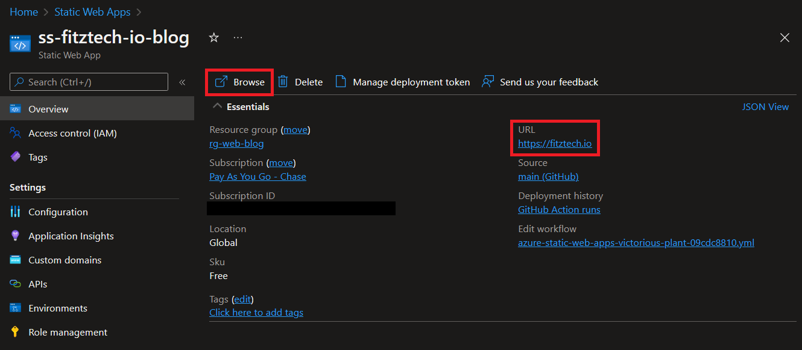

# Introduction
In this article, I outline how I deployed [fitztech.io](https://fitztech.io) using Hugo for site generation, Azure Static Web Apps for web hosting, Cloudflare for DNS, and Github for code hosting and automated deployments. Using these free technologies and services, it is easy to host and maintain a highly performant and economical personal blog, even if you don't have experience in web development. With a willingness to dive into the documentation and build a basic familiarity with Markdown, HTML, and CSS, it is easier than ever to carve out your slice of the internet, and even build some rudimentary DevOps skills. Before diving into the content of the guide, let's quickly review JAMstack and discuss the technologies I've selected for my site.

## What is JAMstack?
If you've done any research into personal blog hosting in recent years, you've likely encountered the term *JAMstack*. According to [Jamstack.org](https://jamstack.org/glossary/jamstack/), "Jamstack is an architectural approach that decouples the web experience layer from data and business logic, improving flexibility, scalability, performance, and maintainability." In practice, Jamstack typically involves the use of static site generators such as Hugo, Gatsby, and Jekyll to precompile HTML sites from markdown templates. These sites are then deployed to Jamstack hosting services like Netlify, Cloudflare Pages, or Vercel, which often offer serverless compute integrations for extending functionality through REST APIs. Finally, while not core to the Jamstack architecture, most Jamstack platforms offer CI/CD integrations with popular Git hosts like Github and Gitlab to automate site deployments and content updates.

## Why This Tech Stack?
### Hugo vs Jekyll vs Gatsby
Hugo, Jekyll, and Gatsby are probably the biggest names among static site generators suited for people not looking to become frontend web developers or designers. Each of these products is roughly equivalent in terms of functionality, and realistically none of them is a bad choice. I selected Hugo for the following reasons:
1. For uninteresting reasons, I had some minimal prior experience with Hugo.
2. Hugo has an abundance of community-built themes. My design skills are very poor, so I wanted something that would look good more or less out of the box.
3. Go lang memes. :smirk:

### Azure Static Web Apps vs Cloudflare Pages
I'm currently focused on mastering the Azure platform for professional reasons, which ultimately is the reason I chose to use Azure Static Web Apps. Cloudflare Pages was my primary alternative, largely because I already host my DNS at Cloudflare. Cloudflare Pages also offers a superior free tier, as detailed in the table below. I never seriously reviewed or considered other competitors like Netlify or Vercel. If I was not already using Azure as my IaaS provider, I would likely have selected Cloudflare Pages.

| Feature               | Azure Static Web Apps    | Cloudflare Pages |
|-----------------------|--------------------------|------------------|
| Bandwidth             | 100 GB/month             | Unlimited        |
| Sites                 | 10                       | Unlimited        |
| Custom Domains        | 2                        | 10               |
| Storage               | 0.5 GB/app, 0.25 GB/file | 0.25 GB/file     |
| Max Concurrent Builds | Unlimited                | 1                |
| Max Monthly Builds    | Unlimited                | 500              |

### Github vs Azure DevOps
While there is much speculation about the future of Azure DevOps in light of Microsoft's acquisition of Github, I've generally not been overly concerned about ADO's prospects given its current adoption level among enterprises. This project, however, proved a good example of one of the common fears brought up by ADO doom-sayers.

I am an Azure AD user and prefer to integrate SSO into applications whenever possible.  Azure DevOps allows Azure AD sign-in integration at all license levels. Github, by contrast, only allows SSO with a Github Enterprise license, which costs $21/user/month at the time of writing. As a result, I attempted to use my Azure DevOps organization for this project initially, but quickly encountered problems setting up the automated deployment integration via the Azure Static Web Apps deployment wizard in the Azure Portal (I will go into more detail on why I used the Portal below). Despite being both a project and organization owner in Azure DevOps, the deployment wizard for the web app failed to populate the repository selection dropdowns for Azure DevOps, effectively breaking my ability to use the native Azure DevOps integration. After doing more research, I found that the integration from Azure Static Web Apps to Azure DevOps is fairly new, being released in May 2022, two months before this writing.  The Github integration, by contrast, has existed since Azure Static Web Apps was released from public preview, and I was able to set up the integration to my personal Github account with little issue.

Many onlookers of the Github-Microsoft acquisition predicted that Github and ADO will continue side by side, with Github receiving top priority for new features while Azure DevOps increasingly lags behind. My experience with this deployment seems to support this concern. Despite this, I may still attempt to migrate back to Azure DevOps to avoid paying the Github SSO tax, but my primary objective was to get this blog up as quickly as possible, and for the time being that meant using Github.

### Cloudflare vs Azure DNS
As previously stated, Azure is my primary IaaS platform, so it may seem natural that I would host my DNS in Azure as well. While I have considered migrating my DNS to Azure, I have been a Cloudflare user for several years and have been consistently pleased with the quality of their service (not to mention the price). Azure DNS still lags behind Cloudflare in terms of functionality for public DNS, with Azure DNS still not supporting seemingly basic features like DNSSEC. By staying on Cloudflare, I also get to benefit from Cloudflare's magic-like ability to propagate DNS change instantaneously worldwide and potentially leverage features like Cloudflare Access down the road.

### Azure Portal vs Terraform
In both work and homelab, I am strong proponent of infrastructure automation and IaC. When I embarked on this project, I intended to build the resources using Terraform, but I soon discovered that Static Web Apps appear to be designed for an interactive deployment. Here is what I found:
1. The deployment of a Static Web App is almost trivially easy, reducing the value of using Terraform to automate the deployment. The Static Web App is a single resource in Azure, so the corresponding Terraform is extremely basic, as shown below.
```terraform
resource "azurerm_resource_group" "blog" {
    name = "rg-web-blog"

    location = "South Central US"
    tags     = local.tags
}

resource "azurerm_static_site" "blog" {
    name     = "ss-fitztech-io-blog"
    sku_tier = "Free"
    sku_size = "Free"

    resource_group_name = azurerm_resource_group.blog.name
    location            = "Central US"
    tags                = local.tags   
}
```
2. Automated integration with Github and Azure DevOps (when it works) is only available when building the Static Web App resource via the Azure portal.
3. Adding custom domains (which involves the creation of certificates in addition to building DNS aliases), must be done in the Azure Portal after deployment, regardless of your initial deployment type.

If you are an automation enthusiast at heart, it can be difficult to put away the fancy tooling and do things the pointy-clicky way. In the case of Azure Static Web Apps, however, the GUI is the more efficient deployment tool.

# Walkthrough
## Prerequisites
This walkthrough assumes the following are already setup:
* [Git](https://git-scm.com/book/en/v2/Getting-Started-Installing-Git)
* [Visual Studio Code](https://code.visualstudio.com/download) or similar text editor
* Free [Github](https://github.com/join) and [Azure](https://azure.microsoft.com/free/) accounts
* If you would like to use a custom domain, like https://fitztech.io, you must purchase that domain and configure a public DNS provider.
## Building Your Hugo Site Locally
The first step in deploying your Hugo blog is to download the Hugo binary and begin building your site locally. A full introduction to Hugo is beyond the scope of this article, but the following steps will allow you to get a basic site up and running on your local machines.
1. Install Hugo by either downloading the binary and adding it to your local path, or by using your computer's package manager. Detailed installation instructions can be found [here](https://gohugo.io/getting-started/installing), and binaries can be downloaded [here](https://github.com/gohugoio/hugo/releases).
2. Build a new site by running the following command. This will create a new folder in your working directory with the standard Hugo folder structure. Your site name in this command should be what you want your git repo to be named.
```
hugo new site <your site name> -f yml
```
> ℹ️ Hugo supports toml, yaml, and json config files. The above command generates a yaml config file which, as a certified yaml engineer, I find preferable.
3. Enter the site folder you just created and initialize a new git repo.
```
git init .
```
3. Browse the themes available at https://themes.gohugo.io/ and find one you like. One of the reasons to use Hugo as a non-designer (like me) is the abundance of freely available, good-looking community themes. This site is using the [PaperMod](https://github.com/adityatelange/hugo-PaperMod) theme, which includes some nice features like dark mode, search, archive templates, and more.  Once you've found a theme you like, add the themes git repo to your project as follows, substituting the URL of your theme's repo:
```
git submodule add --depth=1 <theme git url> themes/<theme name>
```
4. Open the config.yml (or whatever format you chose) file, and specify your theme, as shown below:
```
baseURL: http://example.org/
languageCode: en-us
title: My New Hugo Site

# Add the following line, where theme name is the same as in step 3.
theme: <theme name>
```
5. Many aspects of your site's appearance can be customized through the config file. Check your theme's documentation to see what options you have available. If you choose the PaperMod theme, feel free to check out my [config.yml](https://github.com/kevin-fitzgerald/fitztech-io-blog/blob/main/config.yml) to see how this site is configured.
6. As you develop your site, use Hugo's built-in, live-updating server functionality to preview your site. In the root of your site folder, run `hugo serve` to start the local server, then open up a browser and connect using the URL specified in the server output.

## Uploading Your Site to Github
Once you've finished your initial site configuration, it's time to head over to Github to upload your code. Configuring your Hugo site's repo is no different than any other repo, and can be accomplished as follows:
1. Stage and commit your changes to your local git repository.
```
git branch -m main
git add --all
git commit -m "Initial site upload"
```
> ℹ️ If this is your first time using git, you may be prompted to configure your name and email address when you run the commit command. Follow the commands provided by the git output, then re-run the commit message above to save your changes.
2. Sign in to Github and [create a new](https://github.com/new) repo with the same name as your local site folder. You don't need a README, .gitignore, or license.
3. Back in your local site folder, run the following to link your local repository to Github:
```
git remote add origin https://github.com/<your-github-username>/<your-repo-name>
git push -u origin main
```
4. Refresh your Github repo and you should now see your code!
## Building your Azure Static Web App
Now that your code is in Github, you can proceed with building your Azure Static Web App in the Azure Portal.
1. Log in to the [Azure Portal](https://portal.azure.com) and search for Static Web Apps, then choose "Create" to begin the resource creation wizard.
2. Fill out the wizard as follows:
    * Select your desired subscription, and create a new resource group named whatever you want.
    * Enter any name you would like for your static web app. This is only used as an identifier within Azure and will not be seen publicly.
    * Leave Hosting Plan set to Free.
    * Select an Azure function and staging region close to you or your target audience.
    * In Deployment details, select Github, then launch the **Sign in with Github** link.
    * Select your account and the Hugo repository you created, and set the branch to main.
    * For Build Presets, select **Hugo** and leave the remaining options default.
The wizard should end up looking to this:

3. Select **Review + Create**, then **Create** to deploy the Azure Static Web App.
4. Deploying the Web App will create a `.github/workflows` folder in your Github repo with an automatically generated Github Actions yaml pipeline file. This pipeline defaults to run when new pushes or pull requests are made against the main branch. The pipeline is launched automatically by the Web App creation, and you can view the current run status by opening the **Actions** tab in your Github repo.
5. After the resource is deployed and your Github actions pipeline completes, you can open the Azure Static Web App resource to view the default hostname automatically generated by Azure for your web app in the **URL** field on the **Overview** section. Opening this link will take you to your Web App instance.  You can also select **Browse** to launch your site in a new tab.

6. Congratulations! You now have a personal blog available on the internet!
## Configuring Custom Domains
> ℹ️ The Azure Static Web App Free Tier supports up to two custom domain names

While Azure will automatically create a DNS name for your Static Web App, the automatic names are not suitable for general use. If you are familiar with DNS, you may suspect that we could create CNAME records for a custom domain to alias our Azure-generated hostname - and you would be correct. However, Azure also automatically manages and enables TLS for Static Web Apps. If you simply create a CNAME from your custom domain to the Static Web DNS name without using the Static Web App Custom domains wizard, Azure will not automatically provision a certificate that includes your custom domain, and any attempts to reach your site from your custom domain using HTTPS will result in a TLS error. To resolve this, let's run through the Custom domains wizard.
1. Open the **Custom domains** section of your Static Web App.
2. Select **Add**, then choose either **Custom domain on Azure DNS** or **Custom domain on other DNS** depending on where your DNS is hosted. If your DNS is hosted in Azure the **Custom Domains** wizard will automatically generate the DNS records necessary to validate your domain ownership, so you can skip step 4.
3. Enter the DNS name you will use to access your blog as the **Domain Name**.
4. Use the provided host and value details to create a CNAME record in your public DNS provider, then click Add to complete the **Custom domains** wizard. Azure will attempt to validate the existence of your CNAME record and if all is well will validate your domain ownership and provision updated certificates for your Static Web App.
> ⚠️ DNS replication can take time, so patience may be required during DNS validation.
5. Once your custom domain shows as **Validated** in the **Custom domains** section, you can set your custom name as the default name for your Web App. Web requests to non-default DNS names for your Web App will be automatically redirected to your default DNS name.
6. You should now be able to access your personal blog using your custom domain name!

# Conclusion
JAMstack platforms like Azure Static Web Apps and static site generators like Hugo offer a compelling middle ground for power users looking for something more customizable than a Squarespace site but less time-consuming than a fully custom build. Tight integrations and fierce competition between service providers mean that it is possible to achieve a "DevOps" deployment workflow without requiring deep platform-specific knowledge or significant (re: any) monetary costs. Azure Static Web Apps is a relative newcomer to the JAMstack ecosystem, but the platform manages to hold its own in terms of feature set compared to its more mature competitors, despite the somewhat lackluster free tier offering. If you are already using the Azure platform, Azure Static Web Apps is a fully functional and easy-to-use hosting platform that will not disappoint. If you are not otherwise invested in Azure, you should carefully consider if Cloudflare Pages is a better option for you, particularly for free tier use cases.